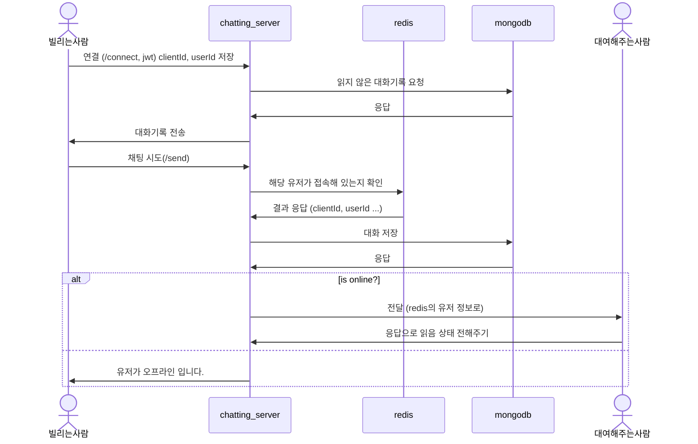

# 중고 책 대여 시스템 

### 기술 스택
spring, redis, redis pub/sub, nestjs, socket.io, aws parameter store

ts-migrate-mongoose

### 폴더 구조


### 채팅 플로우




## @NX
```
eslint 에러로 인한 버전 다운 그레이드 (eslint 8.55.0)
https://github.com/nrwl/nx/issues/20943
```

