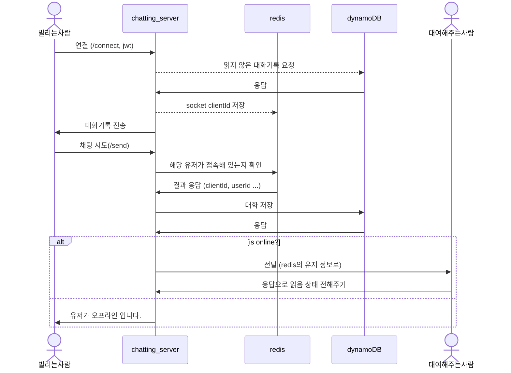

# 중고 거래 채팅 시스템 

```mermaid
sequenceDiagram;
    actor borrower as 빌리는사람
    
    participant server as chatting_server
    participant redis as redis
    participant dynamoDB as dynamoDB
    
    actor lender as 대여해주는사람
    borrower ->> server: 연결 (/connect, jwt) 
    server -->> dynamoDB: 읽지 않은 대화기록 요청
    dynamoDB ->> server: 응답
    server -->> redis: socket clientId 저장
    server ->> borrower: 대화기록 전송
    borrower ->> server: 채팅 시도(/send)
    server ->> redis: 해당 유저가 접속해 있는지 확인
    redis ->> server: 결과 응답 (clientId, userId ...)
    server ->> dynamoDB: 대화 저장
    dynamoDB ->> server: 응답
    alt is online?
        server ->> lender: 전달 (redis의 유저 정보로)
        lender ->> server: 응답으로 읽음 상태 전해주기
    else
        server ->> borrower: 유저가 오프라인 입니다.
    end
    
```

